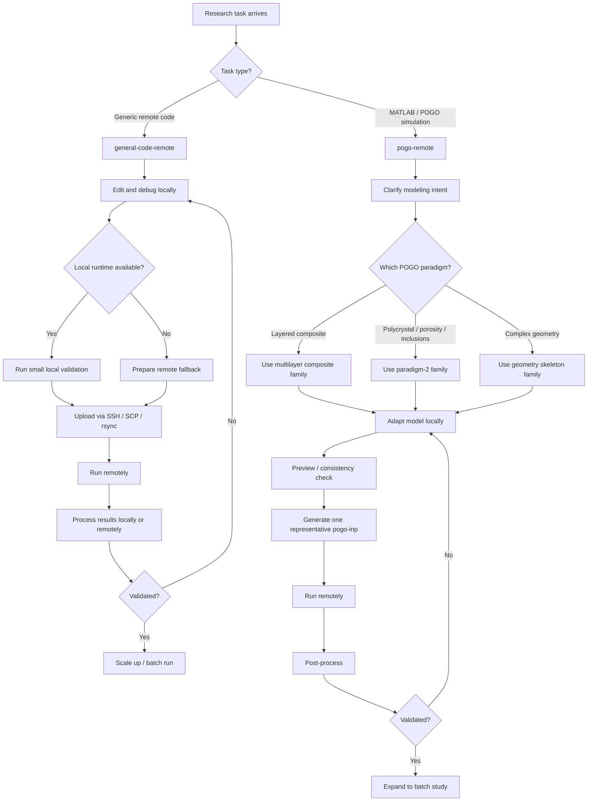
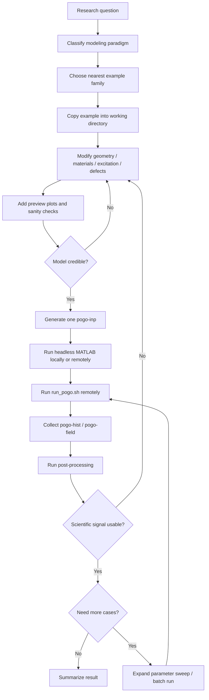

# Remote_auto-research

Reusable agent workflows for **remote engineering / scientific research**.

This repo is designed around one default strategy:

- **debug locally**
- **run heavy / long jobs remotely**
- **process results remotely or locally as appropriate**
- **iterate the model/code**

It currently provides two main reusable modules:

1. **general-code-remote** — generic SSH-based remote execution for long-running code
2. **pogo-remote** — MATLAB -> POGO simulation workflow, post-processing, and iteration

---

## Workflow diagrams

### Overall remote-research workflow



### POGO automated research loop



---

## What this repo is for

This repo is meant to give agents a reusable **remote research operating pattern**, not just one-off prompts.

Typical use cases:

- running large engineering/scientific scripts on remote Linux servers
- local-debug / remote-run pipelines
- MATLAB model generation followed by remote solver execution
- long simulation campaigns with iterative refinement
- automatic post-processing and batch expansion after one validated case

---

## Security principle

This repo must **never** store:

- private SSH keys
- passwords
- API keys
- your real `~/.ssh/config`
- machine-specific private infrastructure details

Agents using these workflows should:

1. first check whether usable SSH configuration already exists locally
2. if not, enter a user-guided SSH setup flow
3. use placeholders/templates inside the repo instead of personal secrets

---

## Repository layout

```text
skills/
  remote-auto-research/        umbrella router skill
  general-code-remote/         generic remote execution skill
    references/
      ssh_onboarding.md        SSH setup flow (no secrets stored)
    templates/
      ssh_config.example       Safe SSH config template with placeholders
  pogo-remote/                 POGO workflow skill
    assets/
      run_pogo.sh              Standard remote POGO runner template
    references/                Modeling paradigms, recipes, post-processing
    examples/
      matlab_multilayer_composite/
      matlab_polycrystal_porosity_textured/
      matlab_complex_geometry_skeleton/

adapters/
  claude-code/
    agents/                    Subagent files (.md with YAML frontmatter)
    commands/                  Slash command files (.md with YAML frontmatter)

scripts/
  install.sh                   Installs for codex / openclaw / claude-code
```

---

## POGO modeling coverage

The `pogo-remote` module currently covers three major modeling paradigms:

1. **Layered / sandwich / honeycomb-derived composite models**
   - e.g. multilayer composite structures
   - best represented by `matlab_multilayer_composite/`

2. **Polycrystal / porosity / inclusion-rich internal topology**
   - e.g. textured grains, pores, inclusions, LoF-type internal features
   - represented by `matlab_polycrystal_porosity_textured/`
   - includes corrected anisotropic POGO material packing guidance

3. **Simple material, complex geometry**
   - geometry-first modeling with explicit vertices or parametric geometry
   - represented by `matlab_complex_geometry_skeleton/`

---

## Cross-tool compatibility

This repo is organized so that one source tree can be reused across:

- **Codex**
- **OpenClaw / AgentSkills-compatible tools**
- **Claude Code**

### Compatibility summary

| Tool | Format used from this repo | Notes |
|---|---|---|
| Codex | `skills/*/SKILL.md` folders | install into `~/.codex/skills/` |
| OpenClaw | `skills/*/SKILL.md` folders | install into `~/.agents/skills/` or another AgentSkills-compatible path |
| Claude Code | `adapters/claude-code/agents/*.md` and `adapters/claude-code/commands/*.md` | installed as Claude Code subagents and slash commands |

---

## Install / pull methods

### 1. Clone the repo

```bash
git clone git@github.com:Junfei-TAI/Remote_auto-research.git
cd Remote_auto-research
```

### 2. Update later

All three tools can use the same repo update method:

```bash
git pull --ff-only
```

If you installed by **symlink**, a `git pull` updates the installed skill automatically.

If you installed by **copy**, rerun the install command after `git pull`.

---

## Install for Codex

### Recommended

```bash
./scripts/install.sh codex --mode symlink
```

This installs the repo skill folders into:

```text
~/.codex/skills/
```

### Copy mode

```bash
./scripts/install.sh codex --mode copy
```

### Manual install

Copy or symlink each folder from:

```text
skills/*
```

to:

```text
~/.codex/skills/
```

---

## Install for OpenClaw

### Recommended shared install

```bash
./scripts/install.sh openclaw --mode symlink
```

This installs into:

```text
~/.agents/skills/
```

If your OpenClaw setup prefers another AgentSkills-compatible directory, use:

```bash
./scripts/install.sh openclaw --mode symlink --target-dir /your/preferred/skills/path
```

### Copy mode

```bash
./scripts/install.sh openclaw --mode copy
```

### Alternative workspace usage

If your OpenClaw setup loads workspace skills directly, you can also run from this repo and let it read the local:

```text
skills/
```

folder.

---

## Install for Claude Code

Claude Code does not use the same `SKILL.md` folder format directly.
This repo provides adapted Claude Code files in:

```text
adapters/claude-code/agents/
adapters/claude-code/commands/
```

### Recommended

```bash
./scripts/install.sh claude-code --mode symlink
```

This installs:

```text
~/.claude/agents/
~/.claude/commands/
```

### Copy mode

```bash
./scripts/install.sh claude-code --mode copy
```

### Manual install

Copy or symlink:

```text
adapters/claude-code/agents/*.md
adapters/claude-code/commands/*.md
```

to:

```text
~/.claude/agents/
~/.claude/commands/
```

---

## Quick usage ideas

### General remote code task

Ask the agent to:

- patch locally
- validate locally if possible
- upload to server
- run remotely
- fetch or remotely post-process results

### POGO task

Ask the agent to:

- clarify the modeling intent
- choose the correct paradigm
- adapt a bundled example family
- run one representative case first
- generate `.pogo-inp`
- run `run_pogo.sh` remotely
- process `.pogo-hist` / `.pogo-field`
- decide whether to iterate or scale up

---

## Important notes for POGO users

- Example MATLAB/POGO code in this repo is intended as a **sanitized starting point**, not a fixed universal model.
- For anisotropic material packing, use the corrected POGO packing pattern in:

```text
skills/pogo-remote/examples/matlab_polycrystal_porosity_textured/material_packing_reference.m
```

- Keep large generated artifacts such as:
  - `.pogo-inp`
  - `.pogo-block`
  - `.pogo-hist`
  - `.pogo-field`
  - figures / temporary outputs

out of git.

---

## Current status of the example families

### `matlab_multilayer_composite/`
- strongest validated family at the moment
- suitable for layered composite / sandwich-style studies

### `matlab_polycrystal_porosity_textured/`
- cleaned and corrected as a paradigm-2 reference family
- anisotropic packing corrected
- some original external research dependencies may still need to be supplied depending on the exact workflow

### `matlab_complex_geometry_skeleton/`
- geometry-first starter skeleton
- useful when vertices, surfaces, or meshing strategy are the main challenge

---

## Recommended maintenance workflow

After changing the repo:

```bash
git pull --ff-only
./scripts/install.sh codex --mode symlink
# or openclaw / claude-code if you installed by copy
```

If using `--mode symlink`, usually only:

```bash
git pull --ff-only
```

is needed.
